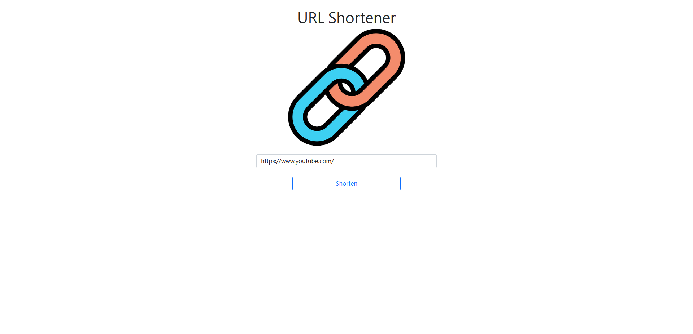
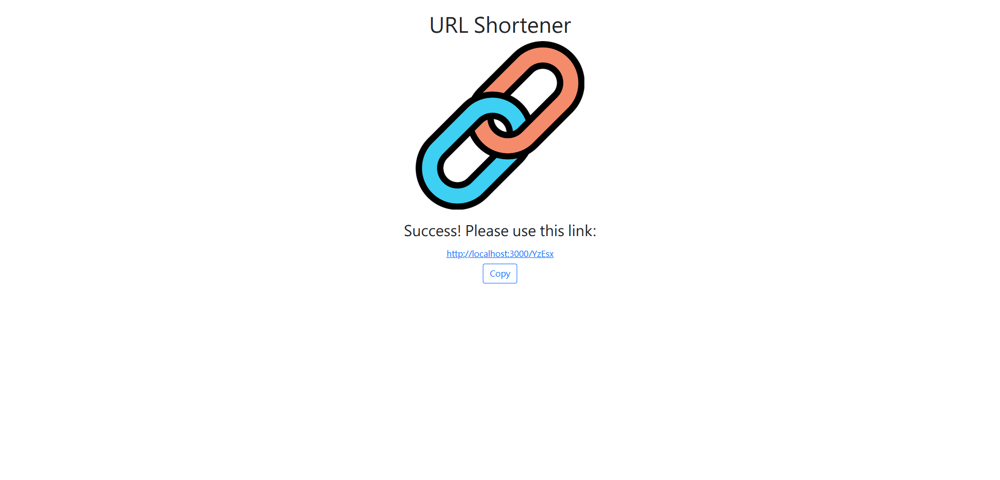

# URL Shortener

URL Shortener is a website built with Node.js, express, mongoDB, and mongoose. It allows users to shorten their long website URLs to short ones.




[中文README](README.zh_TW.md)

## Features

* Shorten a long website URL at the click of a button
* Copy the shortened URL, also at the click of a button
* Same short URL will be generated when the original URL is the same

## Installation and Execution

1. Install Node.js and npm
2. Clone the repository to your local machine
3. Open the repository in your local machine through the Terminal, and run

   ```bash
   npm install
   ```

4. After the installation, run

   ```bash
   npm run start
   ```

5. If you see the message below, it means that Restaurant List works correctly.

   ```bash
   Express is listening on http://localhost:3000
   mongodb connected!
   ```

6. Press ctrl + C to stop the execution


## Technologies

* Node.js 14.16.0
* Express 4.17.1
* Express-Handlebars 4.0.2
* MongoDB
* Mongoose 6.1.1
* Bootstrap 5.1.3