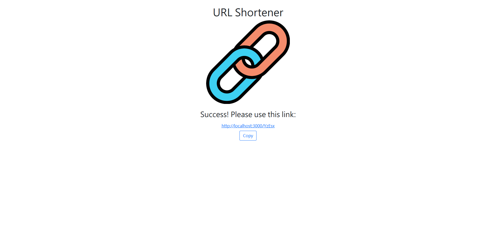

# 短網址產生器

短網址產生器是一個以Node.js、Express、mongoDB和mongoose打造的網頁，讓使用者可以將長網址縮成短網址。




[English README](README.md)

## 功能

* 將長網址縮成短網址
* 按下copy，即可複製短網址
* 相同的URL將會產生相同的短網址

## 安裝與執行步驟

1. 安裝Node.js和npm
2. 把專案複製到本地
3. 在本地開啟之後，透過終端機進入資料夾，輸入：

   ```bash
   npm install
   ```

4. 安裝完畢後，輸入：

   ```bash
   npm run start
   ```

5. 若看見此行訊息則代表順利運作：

   ```bash
   Express is listening on http://localhost:3000
   mongodb connected!
   ```

6. 若欲暫停使用，請按ctrl + c

## 開發工具

* Node.js 14.16.0
* Express 4.17.1
* Express-Handlebars 4.0.2
* MongoDB
* Mongoose 6.1.1
* Bootstrap 5.1.3